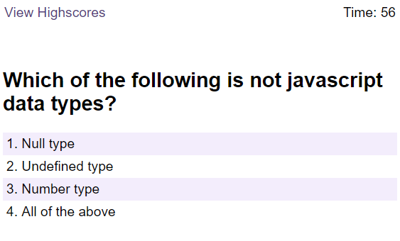

# Password-Generator

## Project Links
Deployed Link: https://nrprabhav.github.io/javaScript-quiz-game/

Repository Link: https://github.com/nrprabhav/javaScript-quiz-game

## Description
A page that offers a quiz on JavaScript. The quiz is scored and if the user wants it, the scores are stored. High scores are displayed.

## Features of the Page
A quiz is offered to the user when the page is opened. The features of the page are:
1. The quiz starts when the "Start Quiz" button is pressed
2. The quiz questions are displayed on the screen
3. The time remaining is displayed on the top right corner of the page. The time starts at 60 secs.
4. Each of the choices in the question is highlighted when you hover on it
5. When a choice is pressed:
  a. A sound is played to indicate if the answer is right or wrong
  b. If the answer is wrong, 10s is deducted from the time
  c. If the answer is correct, 5 marks are added to the score
  d. The next question is displayed
6. When the questions are all over or the timer reached zero, the quiz ends
  a. a page displaying the score is shown
  b. the page has a form to enter initials and store the scores
7. On all the above pages, there is a link to view the high scores on the top left corner
8. On the high scores page, the initials and the scores are displayed
9. The scores are displayed in descending order
10. If the initials are an empty string or more than three characters long, it is not accepted
11. There is a button to go back to the start of the quiz or clear the high scores
12. The high score is saved till cleared even when the page is closed

## Screenshots

### Start Page

### Quiz Question

### End Quiz

### High Scores Page
